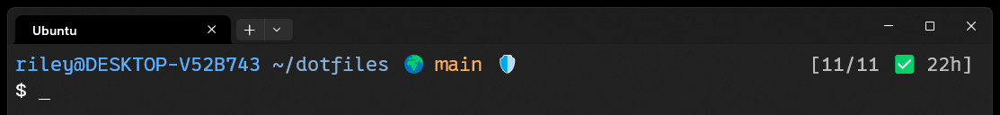

# dotfiles

Terminal, editor and shell as one versioned unit — wezterm, neovim and bash in a
single repo, with every symlink and every dependency declared in one manifest.
Cross-platform: macOS, Linux, WSL, RHEL, and the Windows host.

## Install

One line on a fresh machine — installs git if needed, clones, and runs `make install`:

```sh
curl -fsSL https://raw.githubusercontent.com/roest1/dotfiles/main/bootstrap.sh | bash
```

Already cloned? `cd ~/dotfiles && make install`, then `exec bash`.

### Windows

That line sets up a Unix shell — including WSL, run from inside your distro. The
**Windows host** is a separate install, from PowerShell:

```powershell
irm https://raw.githubusercontent.com/roest1/dotfiles/main/bootstrap.ps1 | iex
```

It installs wezterm and gives you `CTRL+SHIFT+O` — one fuzzy picker for WSL,
PowerShell, cmd, and an admin shell.

**Turn on Developer Mode first**, or creating a symlink is denied and the
installer falls back to *copying* the config — which then stops tracking the
repo. In PowerShell:

```powershell
start ms-settings:developers
```

That opens **Settings → System → Advanced** (Windows 10 filed the same page
under *Privacy & security*, which is why the URI is the route given rather than
a menu path). Turn on:

| Toggle | Section | Why |
| --- | --- | --- |
| **Developer Mode** | For developers | **Required.** Without it symlink creation is denied and the installer copies instead, which silently stops tracking the repo. |
| **Enable sudo** | Terminal | Optional. Only the `PowerShell (Admin)` entry in the shell picker needs it; it is omitted from the picker rather than shown broken. |

**[windows/README.md](windows/README.md)** — the picker, elevation, and why the
Windows config can't be shared with the one inside WSL.

## Just want a cool PS1?



Take the prompt on its own. It is one self-contained file — no framework, no
plugin manager, nothing else from this repo:

```sh
curl -fsSL https://raw.githubusercontent.com/roest1/dotfiles/main/bash/bash_theme -o ~/.bash_theme
echo 'source ~/.bash_theme' >> ~/.bashrc
exec bash
```

| | |
|---|---|
| 🌍 / 🔒 | repo is public / private |
| 🛡️ | branch has protection rules |
| `2 staged  1 unstaged  2 untracked` | working tree |
| 🔼2&nbsp;🔽3 | commits to push / to pull — both at once means diverged |
| `2 conflicting` | that pull would conflict, in 2 files |
| `[11/11 ✅ 22h]` | GitHub Actions for this commit, last run 22h ago |

Bash 3.2+, so macOS's system bash is fine. `git` is the only hard requirement;
`gh` and `jq` add the bracketed CI status and the 🌍/🔒/🛡️ markers. Every tool
is behind a `command -v` guard, so a missing one drops its segment rather than
breaking the prompt.

It spends **one process per prompt** inside a repo and none outside one —
anything needing the network, or a real merge, is read from a cache that a
detached job refreshes. [`bash/bash_theme`](bash/bash_theme) explains why.

## Everything lives in `deps.conf`

One file declares every config symlink and every dependency. **Toggling is
commenting** — there's no flag to remember and no profile vocabulary to learn.

```conf
[nvim]
link  nvim                    ~/.config/nvim
tool  mise||pkg    nvim       neovim     # mise first: apt's is too old
tool  mise||cargo  stylua
tool  uv||pkg      ruff
# tool  pkg        shfmt                 ← commented out = skipped
post  bun install --cwd nvim/lsp-servers --frozen-lockfile
```

Three line types, and that's the whole vocabulary:

| Line | What |
| ---- | ---- |
| `link <repo-path> <dest>` | a symlink; `~` expands to your home |
| `tool <provider> <command> [package]` | a dependency; package defaults to the command name |
| `post <shell command>` | runs after that section's tools |

There is no `platform` line type. The Windows host declares its own payload in
`windows/install.ps1` and reads no manifest, which retired the only section that
ever needed one — CI rejects `platform` as an unknown line type.

| Command | What |
| ------- | ---- |
| `make install` | everything enabled in `deps.conf` |
| `make install nvim` | one section (repeatable: `make install bash nvim`) |
| `make link` | symlinks only — no sudo, no network, nothing downloaded |
| `make check` | verify what's enabled is actually present |
| `make status` | **sync status** — is the machine what `deps.conf` says? |
| `make test` | Lua unit tests (no plugins, no network) |
| `make sections` | list sections |

Sections are named after the program, so there's nothing to name: `[bash]`,
`[nvim]`, `[wezterm]`. The `Makefile` reads them from the manifest —
**adding a program is a new section plus its config file, and no other edits.**

### Installing a subset

The real constraint at work usually isn't "no neovim," it's "not *that*
dependency." So granularity goes down to the individual tool:

- **Skip one tool** — comment its line.
- **Skip a whole program** — `make install bash` instead of `make install`.
- **Install nothing at all** — `make link` gives you every config with no sudo
  and no network.

Scope the one-liner the same way: `DOTFILES_TARGET=bash curl ... | bash`.

**No node, npm or pip anywhere.** The toolchain is bun and uv. The six
JavaScript language servers are declared in `nvim/lsp-servers/package.json`,
installed by `bun install`, and run as `bun <path>` — with no `node` shim, since
aliasing node to bun would make any incompatibility surface as an error blaming
the wrong tool. Mason was dropped because it installs npm packages by shelling
out to the `npm` binary, which only exists if node does. CI asserts on every
push that node, npm and pip stay out of the manifest, and that all six servers
complete a real LSP handshake with node absent from `$PATH`.

### Providers

Each `tool` line names how to install it. `||` declares a fallback chain:

| Provider | Use |
| -------- | --- |
| `pkg`    | system package manager (brew / apt / dnf) |
| `mise`   | tools distros don't reliably carry — pinned versions, binary downloads |
| `uv`     | Python tools (replaces pip; same vendor as ruff) |
| `cargo`  | compiles from source — slow, prefer `mise` |
| `manual` | not installable from here — declares that an official installer or extracted build is an acceptable source; the real install lives in the section's `deps.sh` |

There is no `winget` provider either, and CI rejects it. Windows packages are
declared in `$WingetTools` at the top of `windows/install.ps1`.

There is no `npm` provider, and adding one is a CI failure. See the node
paragraph above.

```conf
tool  pkg||cargo  eza     # distro package if it exists, else compile
```

`[bash]` is near-pure `pkg`, so a locked-down machine can install the whole shell
without mise, node, or a curl-piped installer.

### Drift

`make check` only asks "does this command exist," which turns out to be a weak
question — it happily reports ok for a tool installed by a completely different
provider than the manifest declares. `make status` asks the stronger one, in the
shape ArgoCD uses: **declared state vs. live machine.**

```
[nvim] tools
  ✓ tree-sitter    pkg
  ✗ stylua         declared mise   actual cargo   ~/.cargo/bin/stylua
```

It checks two things:

- **links** — is `~/.bashrc` a symlink into *this* repo, or a stale backup or a
  hand-edited file?
- **tools** — was this installed by the provider the manifest declares?
  Provenance comes from asking `rpm`/`dpkg`/`brew`/`mise`/`uv` directly, not
  from guessing at the path — `~/.local/bin` is genuinely ambiguous between a uv
  shim, an apt rename symlink, and a hand-dropped binary.

It deliberately does **not** report "installed but not declared." Nothing here
can tell a dotfiles dependency from a project-scoped tool, so that list is mostly
noise — and silencing the noise meant naming unrelated projects inside the file
that defines every machine you own. This repo describes itself, nothing else.

Drift matters because a manifest that describes a machine you don't have
produces a *different* machine when you clone it somewhere fresh — which is the
one thing this repo exists to get right.

### Renaming a config file

Rename it in the repo, update its `link` line, re-run. That's the whole
procedure — and the reason it's that short is that `install.sh` prunes orphans.

A rename leaves the old symlink in `$HOME` pointing at a repo path that no
longer exists. Nothing else would ever notice: it isn't in the manifest any
more, so the link loop doesn't walk it, and it sits there looking exactly like a
working dotfile. You'd end up with both names side by side, which is precisely
what renaming was supposed to prevent.

So `install.sh` removes any symlink that **points into this repo and whose
target is gone.** Not a list of retired names — a structural test, which stays
correct for the next rename with nobody remembering to maintain it. It can't
touch a link that still resolves, or one pointing anywhere outside the repo, and
it only scans directories the manifest actually links into.

```
[orphaned links]
  pruned /home/roest/.bash_roest_theme (target gone: .../bash/bash_roest_theme)
```

### Writing a manifest line

`./tools/adopt.sh <command>` figures out the parts that are easy to get wrong —
which provider owns it, and the package name when it differs from the command:

```
$ ./tools/adopt.sh rg fd clangd stylua wezterm
tool  pkg          rg           ripgrep
tool  pkg          fd           fd-find
tool  pkg          clangd       clang-tools-extra
tool  cargo        stylua
tool  pkg||manual  wezterm      # installed outside any manager (~/.local/bin/wezterm)
```

You name the commands. There's **no bulk mode on purpose**: nothing can tell a
dotfiles dependency from a project-scoped tool — a `uv` tool belonging to one
project looks identical to one you want on every machine. It prints; it never
edits `deps.conf`.

It's a script rather than a make target on purpose too: every `make` target is
about *operating* this repo, and this is about *editing* it.

## Layout

| Path | What |
| ---- | ---- |
| `deps.conf` | **the manifest** — links and dependencies, one file |
| `bootstrap.sh` | Curl-able entry point for a fresh machine |
| `install.sh`   | Symlinks only; walks the manifest's `link` lines |
| `bootstrap.ps1` | The same, for the Windows host — `irm ... \| iex` |
| `windows/install.ps1` | Windows host: links + winget. Declares its own payload — it reads no manifest |
| `lib/manifest.sh` | Parses `deps.conf` |
| `lib/providers.sh` | Maps a provider name to an installer; handles `\|\|` chains |
| `lib/pkg.sh`   | The single implementation of "install a tool" |
| `lib/run.sh`   | Installs a section's tools, runs `post` steps and platform fixups |
| `bash/`, `nvim/`, `wezterm/` | Config, plus an optional `deps.sh` for platform-conditional fixups |

`nvim/` is self-contained — its own Makefile and README — so it still stands
alone despite living here.

## Portability is tested, not claimed

`.github/workflows/ci.yml` runs on every push: `make link` on Ubuntu and macOS,
full installs across apt / brew / dnf, shellcheck, manifest validation, and a
job that comments out the node block and asserts nvim still starts clean.

This exists because the previous Makefile promised WSL support in this README
while `make deps` hard-exited on apt. Nothing ever ran it on Ubuntu, so nobody
noticed.

## Contributing

Portability fixes and machinery bugs are welcome; personal-preference changes
aren't (fork instead — the layout is built for it). See
[CONTRIBUTING.md](CONTRIBUTING.md).

## GitHub Terminal Tools

**[Full walkthrough → git/GITHUB_TOOLS.md](git/GITHUB_TOOLS.md)** — walkthroughs and demos for the interactive GitHub tools.

`github` is the way in. `ctrl-/` in any list, `?` in any menu, for that
screen's help.

| Command | What |
| ------- | ---- |
| `github`   | The current repo on GitHub, live: Actions, Pull Requests, Branches, Secrets, Environments |
| `gha`      | Workflow status for HEAD as a table, names linked to their jobs — the one-shot |

Every screen is a list with a live preview. Hover a workflow run and its jobs
appear with only the failed steps expanded, log tail inline; a running one
refreshes under the cursor by itself. Needs fzf ≥ 0.65 (installed via mise
for that reason).

## Layout

<details>
<summary>Directory tree</summary>

```
~/dotfiles/
├── deps.conf                             THE MANIFEST — links + dependencies
├── Makefile                              Reads sections from deps.conf
├── bootstrap.sh                          Curl-able fresh-machine entry point
├── bootstrap.ps1                         The same, for the Windows host
├── install.sh                            Symlink engine (backs up existing files)
├── CONTRIBUTING.md                       How to add a tool without breaking the manifest
├── .githooks/
│   ├── pre-commit                        Blocks committing secrets (core.hooksPath)
│   └── secret-patterns                   Shared by the hook and the CI check
├── .github/
│   ├── workflows/ci.yml                  Portability + supply-chain checks
│   ├── dependabot.yml                    bun + github-actions ecosystems
│   └── CODEOWNERS                        Required for code-owner review
├── lib/
│   ├── manifest.sh                       deps.conf parser
│   ├── providers.sh                      provider dispatch + || chains
│   ├── pkg.sh                            the installers
│   ├── run.sh                            section runner
│   └── status.sh                         declared-vs-actual drift detection
├── tools/
│   └── adopt.sh                          Generates a deps.conf line for a command
├── nvim/                                 Neovim config (own Makefile + README)
│   └── lsp-servers/                      JS language servers + prettier, run by bun
├── wezterm/
│   ├── wezterm.lua                     → ~/.config/wezterm/wezterm.lua        (Linux/macOS)
│   └── wezterm-windows.lua             → %USERPROFILE%\.config\wezterm\wezterm.lua
├── windows/
│   ├── install.ps1                       Windows link + winget engine
│   ├── deps.ps1                          Nerd Font + elevation-helper fixups
│   └── README.md                         Developer Mode, the picker, elevation
├── bash/
│   ├── bashrc                          → ~/.bashrc
│   ├── bash_theme                → ~/.bash_theme
│   ├── bash_productivity         → ~/.bash_productivity
│   ├── bash_git                  → ~/.bash_git
│   ├── bash_github               → ~/.bash_github
│   ├── bash_local                → ~/.bash_local               (untracked)
│   └── bash_password_commands    → ~/.bash_password_commands   (untracked)
├── git/
│   ├── gitconfig                       → ~/.gitconfig
│   ├── README.md                         GitHub tips and tricks
│   ├── GITHUB_TOOLS.md                   Interactive tools walkthrough
│   └── GITHUB_SETUP.md                   New-repo settings + ruleset reference
├── podman/
│   └── README.md                         podman container-engine reference (Linux)
└── systemd/
    └── README.md                         systemctl / journalctl reference (Linux)
```
</details>

Neovim config lives in `nvim/` — merged in from the former `roest1/nvim` repo with
its full history. It keeps its own `Makefile` and `README.md` so the directory
still stands alone.

## What goes where

| File                                | Controls                                                             |
| ----------------------------------- | -------------------------------------------------------------------- |
| `bash/bashrc`                 | Shell options, PATH, package managers, sources theme + productivity   |
| `bash/bash_theme`             | Prompt, colors, LS_COLORS, man page colors                            |
| `bash/bash_productivity`      | Custom commands, aliases, `h` help system                             |
| `bash/bash_git`               | Git aliases and `gprune`                                             |
| `bash/bash_github`            | Plain `gh` (`gha`) + the helpers shared with the TUI                  |
| `bash/bash_github_tui`        | `github` and its screens — the only file that may invoke fzf         |
| `bash/bash_local`             | Machine-specific config — CUDA, nvim path, etc. (untracked)           |
| `bash/bash_password_commands` | Sensitive commands (untracked)                                        |
| `wezterm/wezterm.lua`         | Terminal on Linux/macOS — declares the `mux` domain                   |
| `wezterm/wezterm-windows.lua` | Terminal on the Windows host — the shell picker                       |
| `podman/README.md`            | `podman` container-engine reference (Linux/RHEL)                      |
| `systemd/README.md`           | `systemctl` / `journalctl` reference (Linux/RHEL)                     |

## Machine-local config

Two files hold host-specific setup, sourced by `bashrc` when they exist:

```sh
touch ~/.bash_local && chmod 600 ~/.bash_local
touch ~/.bash_password_commands && chmod 600 ~/.bash_password_commands
```

`~/.bash_local` is for per-machine paths and exports — CUDA, a distro-specific
nvim location. It's sourced immediately after `EDITOR` is set unconditionally,
which makes it the right place for a per-machine `EDITOR` override.
`~/.bash_password_commands` is for anything sensitive.

**They live in `$HOME`, not in this repo, and that is the entire security
design.** Git cannot commit a file outside its work tree — it can't see one. No
`.gitignore` entry to maintain, no rule to remember, nothing to review when
someone edits a config.

This is worth being deliberate about, because the obvious alternative is worse.
Keeping them in `bash/` and gitignoring them makes protection a *rule* rather
than a *property*: `git add -f` overrides it, rewriting `.gitignore` silently
removes it, and you're left auditing a file forever to be sure your passwords
aren't one careless commit from being public.

Two more layers sit behind that, for the secret file someone creates *inside*
the repo later:

| Layer | Catches |
| ----- | ------- |
| `$HOME`, outside the work tree | everything — git cannot see the file |
| `.githooks/pre-commit` | a staged secret, before the commit exists |
| CI: *No secret or machine-local files are tracked* | anything that got past the hook, before it reaches `main` |

The hook and the CI step read the same list, [`.githooks/secret-patterns`](.githooks/secret-patterns),
so they can't drift apart — add a pattern once and both are armed. `install.sh`
points git at the hooks with `core.hooksPath`, so they arrive with a clone
instead of being per-machine setup you have to remember.

Order matters here: the hook is bypassable with `--no-verify` and doesn't exist
until `install.sh` has run once, and CI can only tell you a secret **has already
been pushed**. Neither is a substitute for the file simply not being there.

If you want defence in depth beyond the repo, turn on GitHub's
[push protection](https://docs.github.com/code-security/secret-scanning/push-protection-for-repositories-and-organizations)
— free on public repos. It blocks pushes containing recognised credential
formats, though not arbitrary passwords in a shell script.

## License

MIT
